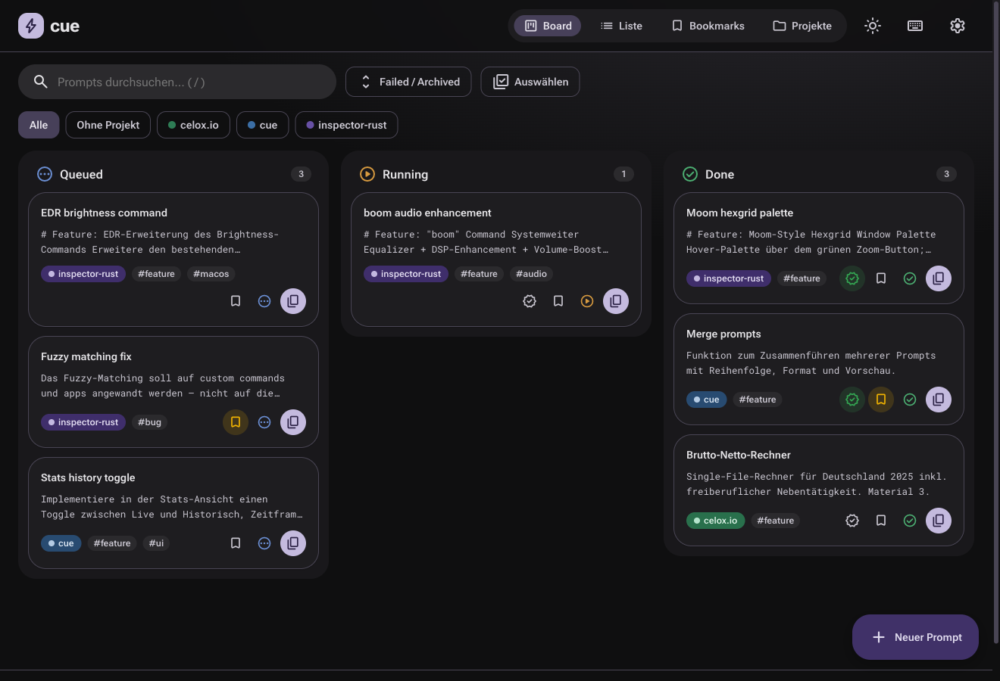
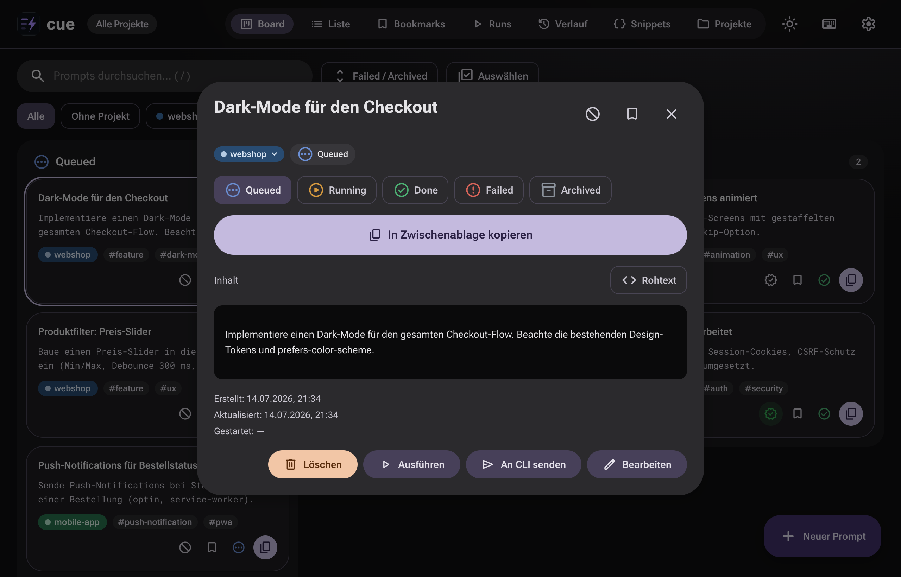
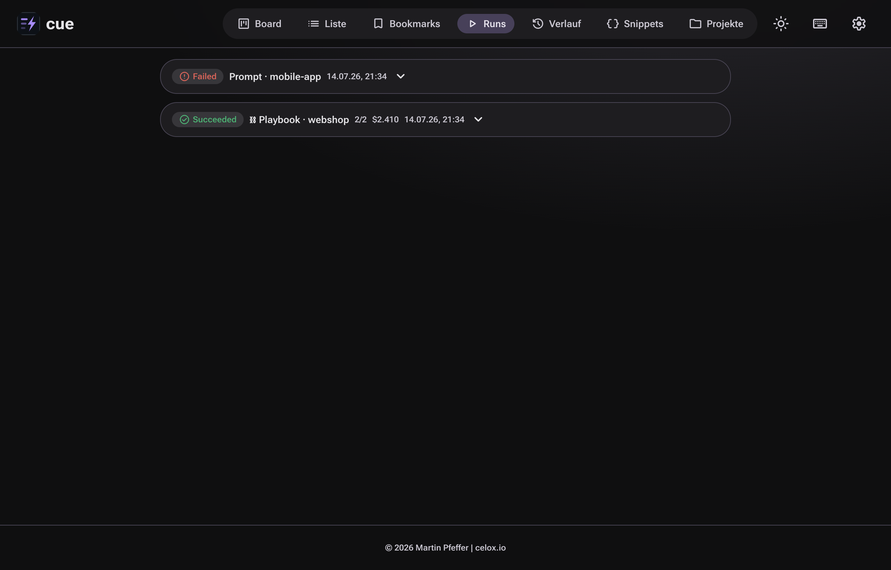
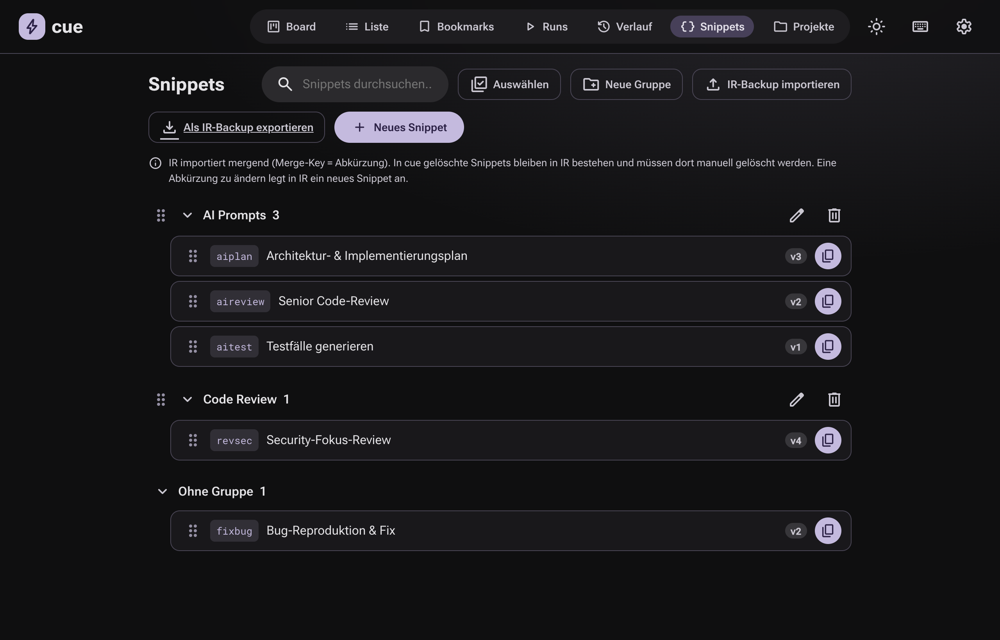
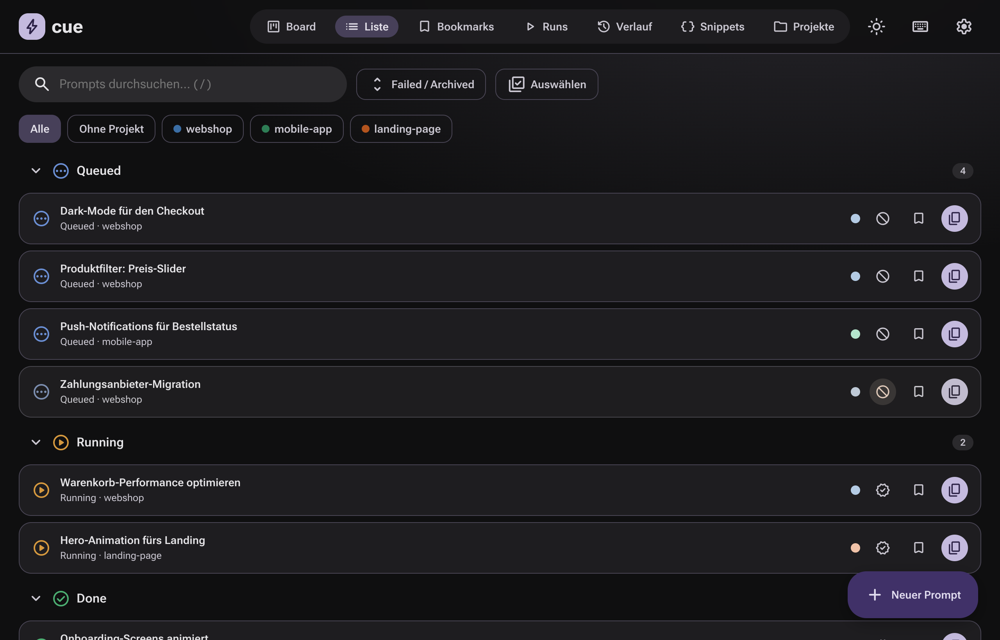
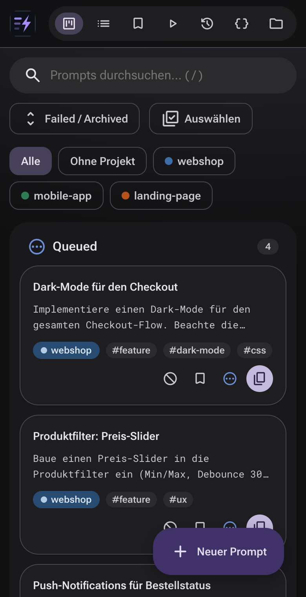
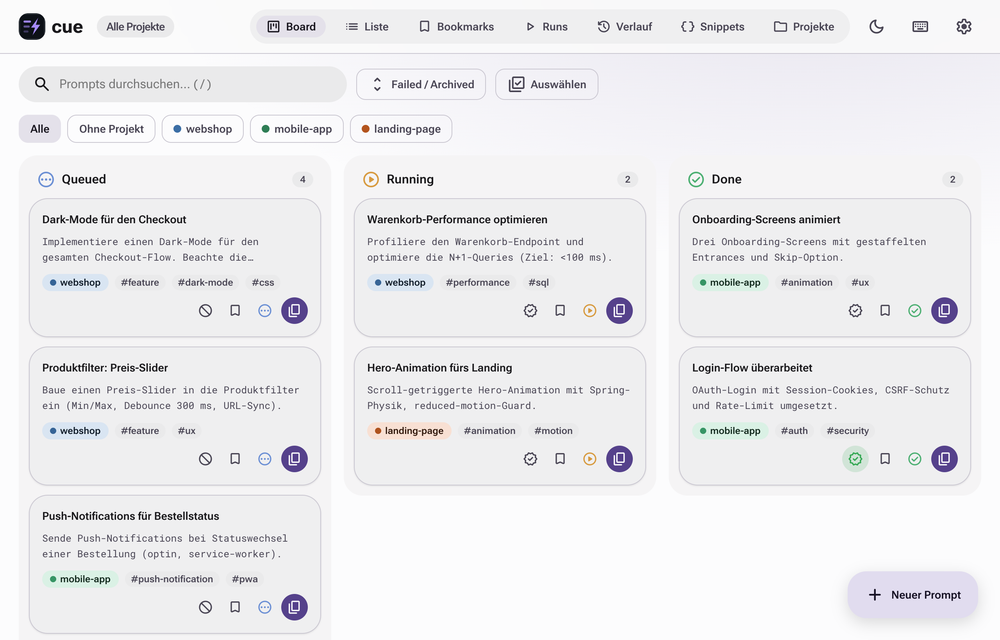

# cue

**Prompt-Queue für Claude-Code-Sessions** — multi-tenant (Google-Login), Material Design 3 Expressive.

<!-- badges:dynamic -->
[](CHANGELOG.md)
[](backend/tests/)
[](backend/tests/)
[](cue-runner/tests/)
[](frontend/src/lib/)
[](backend/tests/)
[](cue-runner/tests/)
[](#)
[](#)
[](#)
[](backend/app/routers/)
<!-- /badges:dynamic -->

[](LICENSE)
[](https://semver.org/)
[](https://github.com/pepperonas/cue/pulls)
[](https://www.conventionalcommits.org/)

[](https://www.python.org/)
[](https://fastapi.tiangolo.com/)
[](https://sqlmodel.tiangolo.com/)
[](https://docs.pytest.org/)
[](https://react.dev/)
[](https://www.typescriptlang.org/)
[](https://vitejs.dev/)
[](https://vitest.dev/)

[](https://tanstack.com/query)
[](https://dndkit.com/)
[](https://motion.dev/)
[](https://m3.material.io/)
[](https://developers.google.com/identity/protocols/oauth2)
[](./Dockerfile)
[](https://web.dev/progressive-web-apps/)
[](https://cue.celox.io)

`cue` (≈ *queue*, „Stichwort zum Handeln") ist eine durchdachte Prompt-/Todo-Queue:
geplante Claude-Code-Prompts erfassen, nach Projekt/Repo gruppieren, über einen
Status-Workflow (Queued → Running → Done) abarbeiten und mit einem Klick in die
Claude-Code-CLI kopieren. Löst lose `.txt`-Sammlungen ab.

## Screenshots

*Alle Screenshots zeigen fiktive Demo-Inhalte.*



| Prompt-Detail | Runs (Headless-Ausführung) |
| --- | --- |
|  |  |

| Snippet-Werkbank (Inspector-Rust-Roundtrip) | Gruppierte Liste |
| --- | --- |
|  |  |

<details>
<summary>Mobil & Light Theme</summary>

| Mobil | Light |
| --- | --- |
|  |  |

</details>

## Features

- **Kanban-Board** mit Drag-zwischen-Spalten (Statuswechsel) + Reorder, optimistisch, Spring-Motion. Nach **Done** verschobene Prompts landen immer **ganz oben**; pro Spalte sind **max. 10 Karten** sichtbar (Rest aufklappbar über „+N weitere anzeigen"). Das aktive Projekt steht animiert **im Header** neben dem cue-Logo.
- **Blocked-Status**: Toggle links vom Bookmark — blockierte Prompts sind ausgegraut, wandern ans Spaltenende, lassen sich nicht draggen und nicht auf Running/Done setzen, bis die Blockierung (Klick) aufgehoben ist.
- **Listenansicht** nach Status **gruppiert + ein-/aufklappbar**; Status dezent farbcodiert (grüner Haken = Done usw.).
- **Bookmarks**: Prompts mit einem Klick anpinnen; eigener Tab zeigt alle Bookmarks, **per Drag & Drop frei sortierbar**.
- **„Getestet"-Status**: für Running-/Done-Prompts markieren, ob das Feature schon getestet wurde (grün gefülltes, animiertes Icon). In **Done** rutschen getestete Karten automatisch unter die ungetesteten und sortieren sich dort nach Ausführungszeit (zuletzt ausgeführt oben).
- **Zusammenführen**: Auswahl-Modus (Button oder **Cmd/Ctrl+Klick** direkt auf Karten/Zeilen — erneuter Cmd/Ctrl+Klick wählt ab) → mehrere Prompts wählen → Merge-Dialog mit Reihenfolge (↑/↓), Format, Live-Vorschau und Wahl, was mit den Originalen passiert (löschen/archivieren/behalten).
- **Löschen mit Undo**: einzeln (aus dem Detail) oder mehrere (Auswahl-Modus) — Toast „Rückgängig" macht das Löschen innerhalb von 6 s ungeschehen.
- **Screenshots**: Bilder per Drag & Drop, Einfügen (Cmd/Ctrl+V) oder Button an Prompts anhängen; Thumbnails + Lightbox im Detail.
- **Run-Engine**: gespeicherte Prompts headless über die **Claude-Code-CLI** ausführen — einzeln oder als **Playbook** (Prompt-Folge in einer Session, Schritte standardmäßig in der **Board-Reihenfolge der Queued-Spalte** — von oben nach unten, unabhängig von der Klick-Reihenfolge). Ein Mac-Runner (`cue-runner/`) pollt cue, führt aus und schreibt Ergebnisse + Live-Log zurück. Owner-only, Pfad-Whitelist, eigener Runs-Tab mit Live-Tail, Cancel & Re-run. Der Run-Dialog **merkt sich die zuletzt genutzten Einstellungen** (Basis, Modell, Permissions, Tools, Schalter) — nur der Unterordner startet leer. Erfolgreiche Steps verschieben ihren Prompt automatisch auf **Done** (fehlgeschlagene auf Failed), ein **schwebendes Status-Overlay** zeigt aktive Runs in jeder Ansicht, und der Runner führt bis zu **3 Runs parallel** aus (`MAX_CONCURRENCY`).
- **Prompt-Capture**: ein `UserPromptSubmit`-Hook protokolliert **jeden** in der Claude-Code-CLI eingegebenen Prompt in cue (Ansicht „Verlauf": eine Karte je Projekt, Sessions als aufklappbare Untergruppen → Prompt-Timeline (neueste zuerst), „in Queue übernehmen"). Projekt-Ableitung übers **Git-Root** des cwd (Gruppierungsordner wie `_customers/` werden übersprungen — jedes Repo wird ein eigenes Projekt), Fallback aufs erste Nicht-`_`-Pfadsegment; per-User Token + Basis-Pfad (multi-tenant).
- **An CLI-Session senden** (Gegenrichtung, owner-only): einen Prompt aus cue direkt in eine **laufende** Claude-Code-Session tippen — nur einfügen oder gleich ausführen. Über den Mac-Runner via iTerm2 (AppleScript) bzw. tmux (bracketed paste); der Capture-Hook liefert den Terminal-Kontext.
- **1-Klick-Copy** auf jeder Karte + im Detail, mit Toast (optional Status `queued → running`); **Doppelklick** auf Karte/Listenzeile kopiert ebenfalls.
- **Im Dialog** selektiert `Cmd/Ctrl+A` nur den Prompt (nicht die Seite dahinter); `Cmd/Ctrl+C` kopiert ihn — direkt auch ohne Auswahl. **Doppelklick auf den Inhalt** öffnet den Bearbeiten-Dialog; `Cmd/Ctrl+Enter` speichert dort — egal, wo der Fokus liegt.
- **Projekt/Repo-Gruppierung** mit farbcodierten Badges + Filter-Chips (**per Drag & Drop direkt im Board sortierbar**); neuer Prompt übernimmt das zuletzt genutzte Projekt. Im Prompt-Detail öffnet der **Projekt-Badge ein Menü**: Prompt in ein anderes Projekt **verschieben** oder als **Kopie** (inkl. Screenshots, landet als Queued) dorthin **duplizieren**.
- **Composer** (FAB → Container-Transform) mit Markdown-Editor, Live-Preview, Autosave-Draft, **Tag-Autocomplete** (~1100 kuratierte EN-Dev-Tags + bereits verwendete Tags, dublettenfrei, amerikanische Schreibweise).
- **Diktat**: Prompts per **Sprachaufzeichnung** erstellen — Mikro-Button am Prompt-Feld (Web Speech API, browser-nativ, kein Server-Roundtrip); erkannte Sätze werden angehängt, Zwischenergebnis läuft live mit. In Browsern ohne Support (Firefox) ausgeblendet.
- **Snippet-Bibliothek**: Bearbeitungs-Werkbank für die AI-Prompt-Snippets aus **Inspector Rust** — IR-Backup-JSON importieren, in cue gruppieren/bearbeiten (Drag & Drop mit Griffen, sichtbarer Auswahl-Modus mit Gruppen-Select-All, Suche, 1-Klick-Copy des Bodys, Live-Duplikat-Check der Abkürzung, Markdown-Vorschau, **Versionsnummer pro Snippet** (v1 aufwärts, zählt bei inhaltlichen Änderungen hoch)), wieder als IR-Backup exportieren und in IR über „Settings → Backup & restore" zurückspielen. **Verlustfreier Roundtrip** (Merge-Key = Abkürzung, Gruppen reisen per Name, auch leere Gruppen überleben); verschlüsselte Backups werden mit klarer Meldung abgelehnt.
- **Import** von `.txt` (Split an `---`/Leerzeilen/keiner) + **Export** als JSON-Backup oder ZIP (`.txt` pro Prompt).
- **MD3 Expressive**: Material-You-Dynamic-Color aus Seed, Light/Dark/System, sichtbare Physik, reduced-motion-aware. Der **Theme-Wechsel** blendet das neue Theme als **Circular Reveal** vom Klickpunkt auf (View Transitions API, wie auf celox.io); ohne API-Support oder bei `prefers-reduced-motion` sofortiger Wechsel.
- **PWA**, installierbar, letzte Daten offline lesbar.
- **Tastatur-Shortcuts** (`n` neu · `/` Suche · `c` kopieren · `j/k` Navigation · `e` editieren · `1/2/3` Status · `?` Overlay).
- **Multi-Tenant**: Login via **Google OAuth** (Authorization-Code-Flow), jeder Nutzer hat eigene Prompts/Projekte. Zugang per **In-App-Freischaltung durch den Admin** (neue Konten warten nach dem Google-Login auf Bestätigung; Settings → Nutzerverwaltung) — die E-Mail-/Domain-Allowlist wirkt zusätzlich als Auto-Freischaltung.
- **Sicherheit**: signierte HttpOnly/Secure/SameSite=Strict-Session (Client-Secret bleibt serverseitig), CSRF-Double-Submit, OAuth-State-Schutz, strikte CSP + Security-Header.

## Tech-Stack

- **Backend**: Python 3.12, FastAPI, SQLModel (SQLAlchemy 2.0 + Pydantic), SQLite (WAL). Auth: argon2-cffi, itsdangerous.
- **Frontend**: React 18 + TypeScript + Vite, `motion` (Spring-Physik), `@dnd-kit`, `@tanstack/react-query`, `vite-plugin-pwa`.
- **Serving**: FastAPI serviert die gebaute `dist/` + die API unter `/api` — ein Container, ein Port.

## Lokale Entwicklung

```bash
# 1) Backend (Terminal A)
cd backend
uv venv && uv pip install -e ".[dev]"     # oder: pip install -r requirements.txt
export CUE_DEV=1                           # erlaubt Start ohne gesetzten Hash/Secret
export COOKIE_SECURE=false                 # http im Dev
uv run uvicorn app.main:app --reload --port 8000

# 2) Frontend (Terminal B) — proxyt /api auf :8000
cd frontend
pnpm install
pnpm dev                                   # http://localhost:5173
```

### Google OAuth einrichten

In der Google Cloud Console einen **OAuth-Client (Webanwendung)** anlegen:
- **Autorisierte JavaScript-Quellen**: `https://cue.celox.io`
- **Autorisierte Weiterleitungs-URIs**: `https://cue.celox.io/api/auth/google/callback`

Client-ID + Secret nach `.env` (`GOOGLE_CLIENT_ID` / `GOOGLE_CLIENT_SECRET`) — niemals committen.
Jeder kann sich mit Google anmelden, landet aber zunächst im Status „wartet auf
Freischaltung" — der Admin (`OWNER_EMAIL`) schaltet Konten unter **Settings →
Nutzerverwaltung** frei oder sperrt sie wieder. `GOOGLE_ALLOWED_EMAILS` /
`GOOGLE_ALLOWED_DOMAINS` wirken als Auto-Freischaltung. `OWNER_EMAIL`
übernimmt beim ersten Login die bestehenden (noch besitzerlosen) Daten.

Im Dev (`CUE_DEV=1`) ist die Konfigurationsprüfung gelockert und die Allowlist offen.

`SECRET_KEY` erzeugen: `openssl rand -hex 32`.

### Tests

Drei Suiten, alle deterministisch und offline lauffähig (externe Abhängigkeiten
gemockt) — zusammen **290 Tests**:

```bash
npm test                             # alle drei Suiten + Badge-Update (posttest)

# einzeln:
cd backend    && uv run pytest                    # 155 Tests — API-Verhalten end-to-end
                                                  # (Auth/OAuth, Tenant-Isolation, CRUD,
                                                  #  Runs, Capture, SPA-Guard, CSP …)
cd cue-runner && .venv/bin/python -m pytest       # 65 Tests — Executor, Orchestrierungs-Loops,
                                                  #  Stream-Parser, Delivery, API-Client (Mocks)
cd frontend   && pnpm vitest run                  # 70 Tests — src/lib (markdown-XSS, tags,
                                                  #  color, api-CSRF, clipboard, speech)
cd frontend   && pnpm typecheck                   # tsc

# Coverage (backend 99 %, runner 91 %):
cd backend && uv run pytest --cov=app --cov-report=term-missing
```

Gemeinsame Backend-Fixtures (Client mit tmp-SQLite, User-/Session-Helpers)
liegen in `backend/tests/conftest.py`.

### README-Badges (LOC + Testanzahl)

`scripts/update-badges.mjs` hält alle **dynamischen Badges** ehrlich — komplett
aus echten Quellen berechnet, nichts hardcodiert:

| Badge | Quelle |
| --- | --- |
| Version | `backend/app/main.py` (`version="…"`) |
| Tests gesamt + je Suite | `pytest --collect-only` / `vitest list` (kein `it()`-Grep — Skips/Todos würden mitzählen) |
| Coverage Backend/Runner | `pytest --cov` (TOTAL-Zeile), Ampelfarbe nach Schwellwert |
| LOC gesamt + Python/TypeScript | Source-Zeilen ohne Tests, `node_modules`, `dist`, Generiertes |
| API-Endpoints | gezählte Route-Dekoratoren im Backend |

Die Badges leben zwischen `<!-- badges:dynamic -->`-Markern im README und werden
in-place ersetzt — idempotent, automatisch nach `npm test` (posttest-Hook) oder manuell:

```bash
npm run update-badges
```

## Deployment (VPS, `cue.celox.io`)

```bash
# 1) .env anlegen (aus .env.example), Hash + Secret eintragen, COOKIE_SECURE=true.
#    ACHTUNG: docker compose interpoliert env_file — jedes '$' im Argon2-Hash
#    MUSS zu '$$' verdoppelt werden (siehe .env.example).
cp .env.example .env && nano .env

# 2) Bauen + starten (Frontend wird im Multi-Stage-Build mitgebaut).
docker compose up -d --build

# Container lauscht auf 127.0.0.1:8791 — Reverse-Proxy davorklemmen:
#   Caddy:  deploy/Caddyfile   (Auto-TLS)
#   nginx:  deploy/nginx.conf  (+ certbot --nginx -d cue.celox.io)
```

Hinter dem Proxy bleibt `COOKIE_SECURE=true` und `TRUST_PROXY=true` (der Proxy setzt
`X-Forwarded-For`). HSTS macht der Proxy.

### Backup & Restore

Die gesamte App-State liegt in einer SQLite-Datei im `cue-data`-Volume (`/data/cue.db`).

```bash
# Backup (Hot-Copy ist mit WAL sicher)
docker compose exec cue sh -c 'cp /data/cue.db /data/cue-backup.db'
docker cp cue:/data/cue-backup.db ./cue-backup-$(date +%F).db

# Restore
docker compose down
docker cp ./cue-backup.db cue:/data/cue.db   # Volume muss existieren
docker compose up -d
```

Alternativ jederzeit über die UI: **Settings → JSON-Backup / ZIP-Export** (pro Konto).

## Snippets ↔ Inspector Rust (Roundtrip-Workflow)

Der **Snippets**-Tab ist die Bearbeitungs-Werkbank für die AI-Prompt-Snippets aus
Inspector Rust (IR). Der komplette Zyklus:

1. **In IR exportieren**: Settings → Backup & restore → Export (unverschlüsselt —
   verschlüsselte Backups lehnt cue mit klarer Meldung ab).
2. **In cue importieren**: Snippets-Tab → „IR-Backup importieren" (oder die Datei
   einfach auf die Ansicht ziehen). Das Ergebnis-Banner zeigt neu/aktualisiert/
   Gruppen/übersprungen samt Fehlerliste; fehlerhafte Zeilen brechen den Import
   nie ab. Gelesen werden der volle IR-Envelope, snippets-only-Backups und das
   Legacy-Listenformat.
3. **Bearbeiten**: Gruppen anlegen/umbenennen (Dialog mit Duplikat-Check),
   Snippets per Griff zwischen Gruppen ziehen, Auswahl-Modus für Bulk-Verschieben/
   -Löschen (Checkbox im Gruppen-Header wählt die ganze Gruppe), Suche über
   Abkürzung/Titel/Body, 1-Klick-Copy des Bodys, Editor mit Monospace-Abkürzung
   (Live-Duplikat-Check) und Markdown-Vorschau.
4. **Exportieren**: „Als IR-Backup exportieren" lädt `ir-snippets-<Datum>.json`;
   optional nur einzelne Gruppen (`GET /api/snippets/export?groups=a,b`).
5. **In IR zurückspielen**: Settings → Backup & restore → Import.

**Merge-Regeln (wichtig):** IR importiert mergend über die **Abkürzung** als
Schlüssel. In cue gelöschte Snippets bleiben in IR bestehen (dort manuell
löschen); eine geänderte Abkürzung legt in IR ein *neues* Snippet an. Gruppen
reisen per Name — auch **leere Gruppen** und ihre Reihenfolge überleben den
Roundtrip. Ein Snippet ohne Gruppe exportiert cue als `category: ""`
(explizit ungruppiert); `null` bedeutet beim Lesen „Zuordnung in IR nicht
anfassen". Zeichengenaue Bodies und Millisekunden-Zeitstempel sind durch einen
Golden-Roundtrip-Test gegen ein echtes IR-Backup abgesichert. Die
**Snippet-Version** reist als additives Feld mit (ältere IR-Builds ignorieren
es); beim Merge gilt beidseitig: Inhalt geändert → `max(incoming, lokal+1)`,
identisch → `max(incoming, lokal)`.

## Konto / Abmelden

Login & Identität laufen komplett über Google. **Settings → Konto** zeigt das angemeldete
Konto und bietet **Abmelden**. Zugang wird zentral über die Allowlist in der `.env` gesteuert.

## Projektstruktur

```
backend/    FastAPI + SQLModel API, Google-OAuth/Security, Run-Engine, Tests (117, conftest.py)
frontend/   React + TS + Vite, MD3-Expressive-UI, dnd-kit Board, PWA, Vitest (src/lib)
cue-runner/ Mac-Daemon: führt Prompts über die Claude-Code-CLI aus (eigenes README, 65 Tests)
scripts/    update-badges.mjs — LOC-/Test-Badges im README automatisch aktualisieren
deploy/     Caddyfile + nginx.conf
docs/       Screenshots
package.json  Root-Skripte: npm test (alle Suiten) + posttest-Badge-Hook
Dockerfile  Multi-Stage (node build → python runtime)
```

## Versionierung

Das Projekt folgt [Semantic Versioning](https://semver.org/) (`MAJOR.MINOR.PATCH`).
Aktuelle Version: **0.19.1**. Änderungen sind im [CHANGELOG](CHANGELOG.md) dokumentiert.

## Lizenz

[MIT](LICENSE) © 2026 Martin Pfeffer ([celox.io](https://celox.io))

## Autor

**Martin Pfeffer** — [celox.io](https://celox.io)

---

© 2026 Martin Pfeffer | celox.io
