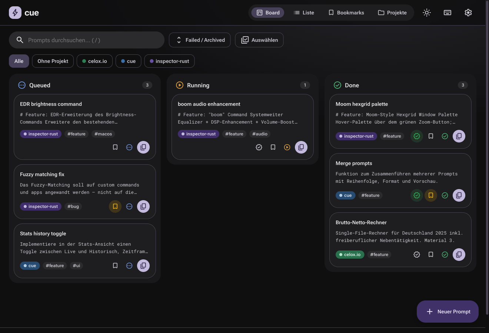
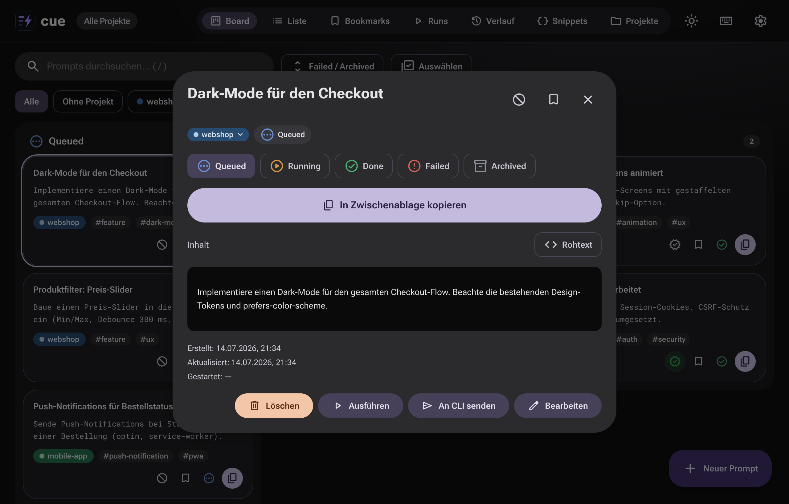
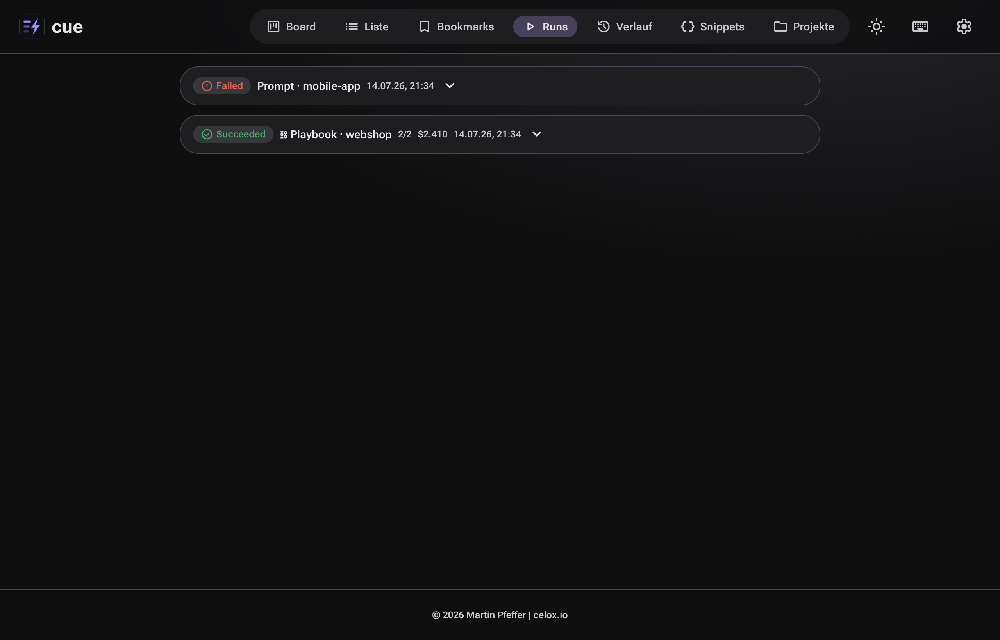
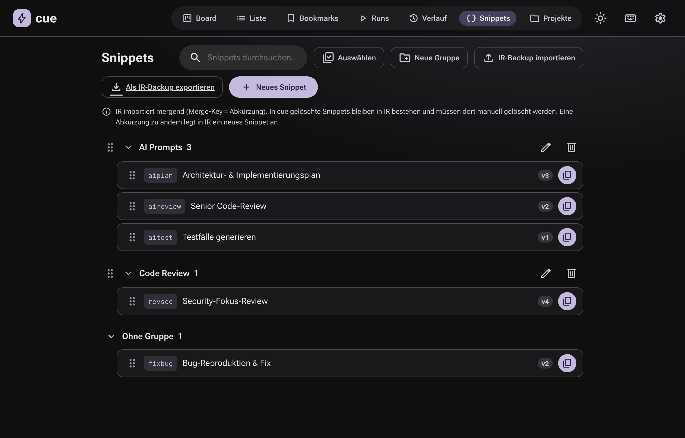
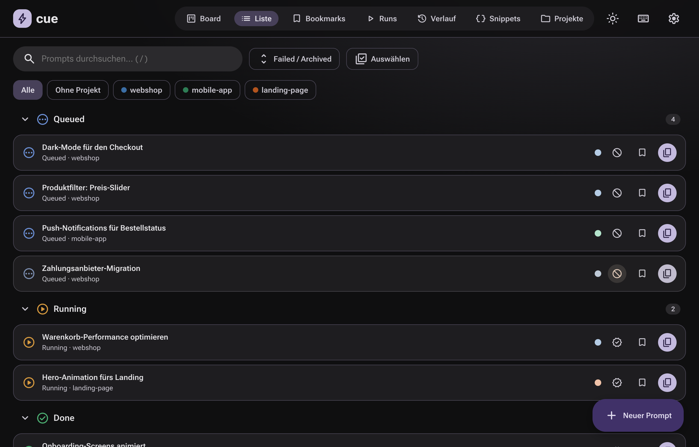
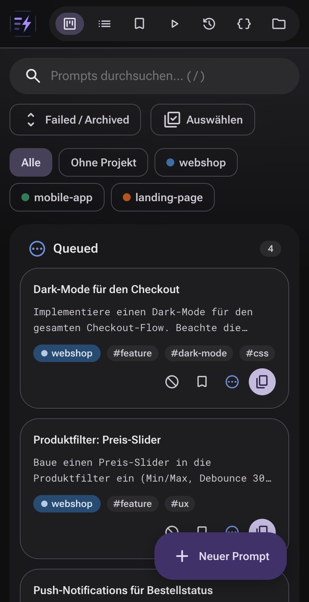
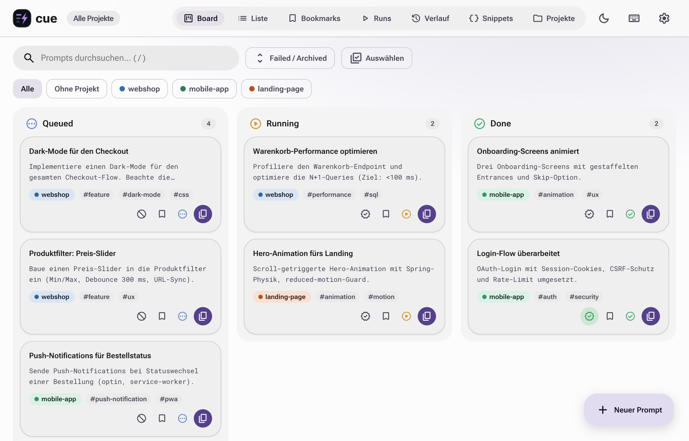

# cue

**Prompt-Queue für Claude-Code-Sessions** — multi-tenant (Google-Login), Material Design 3 Expressive.

<!-- badges:dynamic -->
[](CHANGELOG.md)
[](docs/TESTING.md)
[](backend/tests/)
[](cue-runner/tests/)
[](frontend/src/lib/)
[](scripts/tests/)
[](backend/tests/)
[](cue-runner/tests/)
[](frontend/src/lib/)
[](docs/TESTING.md)
[](docs/TESTING.md)
[](docs/TESTING.md)
[](#)
[](#)
[](#)
[](#)
[](docs/API.md)
[](docs/ARCHITECTURE.md)
[](frontend/src/components/)
[](docs/)
<!-- /badges:dynamic -->

[](LICENSE)
[](https://semver.org/)
[](CONTRIBUTING.md)
[](https://www.conventionalcommits.org/)
[](CHANGELOG.md)
[](SECURITY.md)
[](docs/)
[](https://claude.com/claude-code)

[](https://www.python.org/)
[](https://fastapi.tiangolo.com/)
[](https://sqlmodel.tiangolo.com/)
[](https://docs.pytest.org/)
[](https://react.dev/)
[](https://www.typescriptlang.org/)
[](https://vitejs.dev/)
[](https://vitest.dev/)
[](frontend/eslint.config.js)
[](frontend/tsconfig.json)
[](https://docs.astral.sh/uv/)
[](https://pnpm.io/)

[](https://tanstack.com/query)
[](https://dndkit.com/)
[](https://motion.dev/)
[](https://m3.material.io/)
[](https://developers.google.com/identity/protocols/oauth2)
[](./Dockerfile)
[](https://web.dev/progressive-web-apps/)
[](https://cue.celox.io)
[](docs/ARCHITECTURE.md)
[](docs/API.md)
[](docs/TESTING.md)
[](docs/TESTING.md)

`cue` (≈ *queue*, „Stichwort zum Handeln") ist eine durchdachte Prompt-/Todo-Queue:
geplante Claude-Code-Prompts erfassen, nach Projekt/Repo gruppieren, über einen
Status-Workflow (Queued → Running → Done) abarbeiten und mit einem Klick in die
Claude-Code-CLI kopieren. Löst lose `.txt`-Sammlungen ab.

## Dokumentation

| Dokument | Inhalt |
| --- | --- |
| **[docs/ARCHITECTURE.md](docs/ARCHITECTURE.md)** | Wie die Teile zusammenhängen: ein Prozess/ein Port, Datenmodell, Mandantentrennung, Live-Sync, der Runner |
| **[docs/CONFIGURATION.md](docs/CONFIGURATION.md)** | Jede Umgebungsvariable mit Standard und Wirkung — testgepinnt gegen `config.py` |
| **[docs/API.md](docs/API.md)** | Alle Endpunkte, wer sie aufrufen darf, Statuscodes, Long-Poll — testgepinnt gegen die Routen |
| **[docs/TESTING.md](docs/TESTING.md)** | Wie hier getestet wird und warum so (inklusive der Mutationsprobe) |
| **[SECURITY.md](SECURITY.md)** | Sicherheitsmodell, Grenzen, Meldeweg |
| **[CONTRIBUTING.md](CONTRIBUTING.md)** | Einrichten, Regeln, Commit-Konventionen |
| **[CHANGELOG.md](CHANGELOG.md)** | Alle Versionen |
| **[CLAUDE.md](CLAUDE.md)** | Die Fallstricke im Detail — Arbeitsgrundlage am Code |
| **[cue-runner/README.md](cue-runner/README.md)** | Der Mac-Daemon |

## Screenshots

*Alle Screenshots zeigen fiktive Demo-Inhalte.*



| Prompt-Detail | Runs (Headless-Ausführung) |
| --- | --- |
|  |  |

| Snippet-Werkbank (Inspector-Rust-Roundtrip) | Gruppierte Liste |
| --- | --- |
|  |  |

<details>
<summary>Mobil & Light Theme</summary>

| Mobil | Light |
| --- | --- |
|  |  |

</details>

## Features

- **Kanban-Board** mit Drag-zwischen-Spalten (Statuswechsel) + Reorder, optimistisch, Spring-Motion. Nach **Done** verschobene Prompts landen immer **ganz oben**; **neu angelegte Prompts mit Bug-Tag** (`bug`, `bugfix`, …) landen ebenfalls **oben in der Queue**. Pro Spalte sind **max. 10 Karten** sichtbar (Rest aufklappbar über „+N weitere anzeigen"). Das aktive Projekt steht animiert **im Header** neben dem cue-Logo. **Mehrere ausgewählte Prompts wandern gemeinsam**: eine selektierte Karte ziehen nimmt die ganze Auswahl mit (alle mitgezogenen Karten hängen sichtbar am Cursor), oder man nutzt die Ziel-Buttons Queued/Running/Done in der Auswahlleiste — auf dem Handy der bequemere Weg.
- **Blocked-Status**: Toggle links vom Bookmark — blockierte Prompts sind ausgegraut, wandern ans Spaltenende, lassen sich nicht draggen und nicht auf Running/Done setzen, bis die Blockierung (Klick) aufgehoben ist.
- **Listenansicht** nach Status **gruppiert + ein-/aufklappbar**; Status dezent farbcodiert (grüner Haken = Done usw.).
- **Bookmarks**: Prompts mit einem Klick anpinnen; **direkt im Tab anlegbar** (ohne Projektbezug — Filter und zuletzt genutztes Projekt werden bewusst ignoriert); eigener Tab zeigt **immer alle** Bookmarks — unabhängig davon, welches Projekt gerade gefiltert ist —, **per Drag & Drop frei sortierbar**. Bookmarks werden außerdem **universell optimiert** (siehe KI-Prompt-Optimierung).
- **„Getestet"-Status**: für Running-/Done-Prompts markieren, ob das Feature schon getestet wurde (grün gefülltes, animiertes Icon). In **Done** rutschen getestete Karten automatisch unter die ungetesteten; innerhalb beider Blöcke gilt die selbst gezogene Reihenfolge.
- **Zusammenführen**: Auswahl-Modus (Button oder **Cmd/Ctrl+Klick** direkt auf Karten/Zeilen — erneuter Cmd/Ctrl+Klick wählt ab) → mehrere Prompts wählen → Merge-Dialog mit Reihenfolge (↑/↓), Format, Live-Vorschau und Wahl, was mit den Originalen passiert (löschen/archivieren/behalten). Das Ergebnis landet **ganz oben** in seiner Spalte — man arbeitet als Nächstes daran.
- **Löschen mit Undo**: einzeln (aus dem Detail) oder mehrere (Auswahl-Modus) — Toast „Rückgängig" macht das Löschen innerhalb von 6 s ungeschehen.
- **Screenshots**: Bilder per Drag & Drop, Einfügen (Cmd/Ctrl+V — auch direkt im Prompt-Textfeld) oder Button an Prompts anhängen; Thumbnails + Lightbox im Detail. Jedes Bild wird **vor dem Upload im Browser zu WebP verkleinert** (längste Kante 2048 px) — ein 2400×1422-Screenshot schrumpft von 189 KB auf 44 KB; animierte GIFs bleiben unangetastet, und wenn die Neukodierung nichts bringt, wird das Original behalten. **Nach 30 Tagen werden Screenshots automatisch gelöscht.**
- **Run-Engine**: gespeicherte Prompts headless über die **Claude-Code-CLI** ausführen — einzeln oder als **Playbook** (Prompt-Folge in einer Session, Schritte standardmäßig in der **Board-Reihenfolge der Queued-Spalte** — von oben nach unten, unabhängig von der Klick-Reihenfolge). Ein Mac-Runner (`cue-runner/`) pollt cue, führt aus und schreibt Ergebnisse + Live-Log zurück. Owner-only, Pfad-Whitelist, eigener Runs-Tab mit Live-Tail, Cancel & Re-run. Der Run-Dialog **merkt sich die zuletzt genutzten Einstellungen** (Basis, Modell, Permissions, Tools, Schalter) — nur der Unterordner startet leer. Erfolgreiche Steps verschieben ihren Prompt automatisch auf **Done** (fehlgeschlagene auf Failed), ein **schwebendes Status-Overlay** zeigt aktive Runs in jeder Ansicht, und der Runner führt bis zu **3 Runs parallel** aus (`MAX_CONCURRENCY`).
- **Prompt-Capture**: ein `UserPromptSubmit`-Hook protokolliert **jeden** in der Claude-Code-CLI eingegebenen Prompt in cue (Ansicht „Verlauf": eine Karte je Projekt, Sessions als aufklappbare Untergruppen → Prompt-Timeline (neueste zuerst), „in Queue übernehmen"). Projekt-Ableitung übers **Git-Root** des cwd (Gruppierungsordner wie `_customers/` werden übersprungen — jedes Repo wird ein eigenes Projekt), Fallback aufs erste Nicht-`_`-Pfadsegment; per-User Token + Basis-Pfad (multi-tenant).
- **An CLI-Session senden** (Gegenrichtung, owner-only): einen Prompt aus cue direkt in eine **laufende** Claude-Code-Session tippen — nur einfügen oder gleich ausführen. Über den Mac-Runner via iTerm2 (AppleScript) bzw. tmux (bracketed paste); der Capture-Hook liefert den Terminal-Kontext.
- **Zentrale Tag-Verwaltung**: Tags sind eine eigene Entität mit ID statt bloßer Textliste — eigener **Tags-Tab** mit Suche, Sortierung (Verwendung/Name/Neueste/Zuletzt genutzt), Verwendungszähler, Herkunft (System/Benutzer) und Anlagedatum. **Umbenennen wirkt global** (alle Prompts ziehen automatisch nach; ein bereits existierender Name führt beide Tags zusammen, ohne Duplikate), **Löschen** zeigt vorher, welche Prompts betroffen sind, und bietet an, den Tag durch einen anderen zu **ersetzen** statt ihn ersatzlos zu entfernen. Neu angelegte Tags stehen sofort projekt- und promptübergreifend im **Autocomplete**, das nach Relevanz sortiert (exakt → Präfix → Wortanfang → Teiltreffer, dann Häufigkeit und letzte Nutzung) und Verwendungszahl bzw. Herkunft direkt anzeigt. Groß-/Kleinschreibung und Leerzeichen werden serverseitig normalisiert, bestehende Tags wurden automatisch migriert. **Bug-Tags priorisieren**: ein neuer Prompt mit Tag `bug` / `bugfix` / `bug-…` landet **oben in der Queued-Spalte** (nur beim Anlegen).
- **Mobile-Board**: auf dem Smartphone werden die Status-Bereiche zu **einklappbaren Sektionen**, deren Karten nach **Projekt gruppiert** sind — eingeklappt bleiben Projektname, Farbe und Kartenanzahl sichtbar, lange Spalten starten zusammengeklappt und der Zustand hält die Sitzung über. Dazu: Projektfilter als eine scrollbare Zeile statt sechs, 40-px-Touch-Ziele, kompaktere Karten.
- **Live-Aktualisierung zwischen Geräten**: was auf dem Telefon entsteht, erscheint am Rechner ohne Neuladen — und umgekehrt. Jeder Browser hält dafür genau **eine** Anfrage offen, die antwortet, sobald sich etwas ändert (gemessen: 0,18 s), und bis dahin nichts kostet. Aktualisiert wird nur, was die Änderung wirklich betrifft. Im Hintergrund ruht die Schleife und holt beim Zurückkehren in einer einzigen Anfrage auf.
- **Dialoge auf dem Telefon** sind **Bottom-Sheets**: volle Breite, an der Unterkante verankert, oben abgerundet, Safe-Area berücksichtigt. **Die Tastatur verdeckt die Knöpfe nicht mehr** — die Dialoge messen den tatsächlich sichtbaren Bereich (Android über den Viewport-Hinweis, iOS über `visualViewport`), und Eingabefelder lösen kein Hineinzoomen auf iOS mehr aus.
- **Zurück-Geste schließt Dialoge** statt die App: jedes Overlay registriert sich in einem History-Stack, verschachtelte Dialoge werden nacheinander abgebaut, und erst der leere Stack verlässt die App. Escape nutzt exakt dieselbe Reihenfolge.
- **Touch-Drag & Drop**: Karten lassen sich per Long-Press ziehen, ein normaler Wisch scrollt weiterhin (vorher startete jede Fingerbewegung über einer Karte einen Drag). Inklusive Auto-Scroll am Rand, Haptik beim Aufnehmen, sauberem Abbruch per Escape und Tastatur-Bedienung.
- **KI-Prompt-Optimierung**: ✨-Button auf jeder Karte/Zeile schreibt den Prompt per **Claude Code CLI** um (Meta-Prompt für Struktur, Rollenklarheit, Ausgabeformate). Das **Original bleibt immer erhalten** — die optimierte Fassung liegt daneben, umschaltbar über **Original / Optimierte Version / Unterschiede** mit **GitHub-artigem Diff** (grün/rot, wortgenau). Eine fertige Optimierung ist ein **Vorschlag**: sie **öffnet sich von selbst in der Diff-Ansicht**, unter dem Diff stehen **Übernehmen** und **Verwerfen** — nach dem Übernehmen schließt sich der Dialog und die Karte zeigt sofort den neuen Text. Optimierst du erneut, ohne entschieden zu haben, wird die ältere Fassung als **ersetzt** markiert (nachlesbar, aber nicht mehr übernehmbar) — es ist immer nur ein Vorschlag offen — erst Übernehmen schreibt den Text in den Prompt, Verworfenes bleibt in der Historie nachlesbar. **Bookmarks werden universell optimiert**: projektgebundene Angaben (Pfade, Modul-/Repo-/Projektnamen, Framework) werden zu Platzhaltern, während alles, was dem Autor gehört und überall gleich ist (eigene Links, Konten, Marken- und Produktnamen), unverändert stehen bleibt — das Ergebnis passt so in jedes Projekt. **Erneut optimieren** schickt Original *und* letzte Fassung an Claude und legt eine neue Version an; ältere Versionen bleiben über die Historie (v1, v2, …) abrufbar, inklusive Modell, Dauer, Kosten und Tokens. **„Alle optimieren"** arbeitet alle noch nicht optimierten Prompts **nacheinander** ab (Fortschrittsanzeige „12 / 143", Abbrechen, fehlerhafte werden übersprungen und am Ende gezählt). Ausgeführt wird auf dem Mac-Runner — der Server ruft nie eine Shell auf; Provider-Architektur, sodass später OpenAI/Gemini/Ollama ohne Änderung am Rest ergänzt werden können. **Welches Modell schreibt, legt `OPTIMIZE_MODEL` fest** (Standard `opus`). Bleibt die Variable leer, wird gar kein `--model` übergeben und es rechnet das, worauf die Claude-Code-CLI auf dem Runner-Mac gerade eingestellt ist — ein `/model` dort ändert dann still mit, womit deine Prompts umgeschrieben werden. Die Historie hält pro Versuch fest, welches Modell **tatsächlich** geantwortet hat (ein Alias wie `opus` löst sich erst in der CLI zu einem konkreten Namen auf).
- **Statistiken**: eigener Tab mit Analytics-Dashboard — KPI-Kacheln mit Sparkline und Vergleich zur Vorperiode (erstellt / erledigt / bearbeitet / gelöscht / CLI-Prompts / Serie / Durchlaufzeit / Backlog) und Sektionen für **Prompts** (Zeitverlauf, Statusverteilung, Längen), **Nutzung** (Aktivitätskalender, Wochentag×Stunde-Heatmap, Wochentags-Radar, Tageszeiten, Streaks), **Projekte** (Top-Listen, Treemap, zuletzt verwendet), **Tags** (Top, Wolke, Vokabular-Wachstum) und **KI-Runs** (Kostenverlauf, Erfolgsquote, Laufzeit). Zeitraum umschaltbar von **Heute bis Gesamt** inkl. **benutzerdefiniertem** Bereich; Tages-/Stundenraster in der **Zeitzone des Browsers**. Charts mit Recharts, nur in diesem Tab nachgeladen.
- **1-Klick-Copy** auf jeder Karte + im Detail, mit Toast (optional Status `queued → running`); **Doppelklick** auf Karte/Listenzeile kopiert ebenfalls.
- **Im Dialog** selektiert `Cmd/Ctrl+A` nur den Prompt (nicht die Seite dahinter); `Cmd/Ctrl+C` kopiert ihn — direkt auch ohne Auswahl. **Doppelklick auf den Inhalt** öffnet den Bearbeiten-Dialog; `Cmd/Ctrl+Enter` speichert dort — egal, wo der Fokus liegt.
- **Projekt/Repo-Gruppierung** mit farbcodierten Badges + Filter-Chips (**per Drag & Drop direkt im Board sortierbar**). Jeder Chip zeigt, **wie viel dort offen ist** — Queued plus Running, **ohne blockierte** Prompts; wo nichts offen ist, steht auch keine Zahl.  neuer Prompt übernimmt das zuletzt genutzte Projekt. Im Prompt-Detail öffnet der **Projekt-Badge ein Menü**: Prompt in ein anderes Projekt **verschieben** oder als **Kopie** (inkl. Screenshots, landet als Queued) dorthin **duplizieren**.
- **Composer** (FAB → Container-Transform) mit Markdown-Editor, Live-Preview, Autosave-Draft und **Tag-Autocomplete** (~1100 kuratierte EN-Dev-Tags + bereits verwendete Tags, dublettenfrei, amerikanische Schreibweise).
- **Titel vervollständigt sich Wort für Wort**: das Feld zeigt den nächsten Wortvorschlag als graue Fortsetzung hinter dem Cursor, **Enter** übernimmt **genau ein Wort**, danach steht sofort der nächste Vorschlag da; `→` am Feldende tut dasselbe, Escape blendet ihn aus, ohne den Dialog zu schließen. Die Vorschläge stammen aus den **eigenen bisherigen Titeln**, nicht aus einer Wortliste. Die Schwellen sind gemessen, nicht geschätzt: auf leerem Feld trifft ein Rateversuch nur zu 2 % — deshalb kommt dort nie einer; beim Vervollständigen des getippten Wortes sind es 25 / 36 / 51 % bei 1 / 2 / 3 Zeichen, also beginnt der Vorschlag ab dem zweiten Zeichen.
- **Tags entstehen aus dem Titel**: „doku updaten" trägt `documentation` ein, „theme wechsel fixen" trägt `bugfix` ein — das Feld füllt sich, solange man es nicht selbst anfasst, und eine Zeile darunter sagt, woher die Tags kommen. Geschrieben wird nur, was **messbar trägt** (`doku`→documentation ×28,3 gegenüber der Grundrate, `animier`→animation ×8,2, `fix|fehler`→bugfix ×4,8); was das nicht tut (`optimier` nur ×1,8, `button|icon`→gui gar nicht), wird ausschließlich **vorgeschlagen**. Höchstens zwei automatisch, und beim **Bearbeiten** eines bestehenden Prompts nie.
- **Zwei Wege, ein Tag zu beenden**: `→` und `Tab` übernehmen den **Vorschlag** (graue Ergänzung bzw. markierte Zeile), **Enter, Leertaste und Komma** speichern **das Getippte wörtlich**. Danach ist das Feld sofort für das nächste Tag bereit und die Liste öffnet wieder — neu sortiert nach dem, was mit dem gerade gesetzten Tag zusammen auftritt. Die Vorschlagstasten greifen nur, solange getippt wird: bei leerem Token trägt `Tab` den Fokus weiter, statt die Tastatur im Feld einzusperren.
- **Diktat**: Prompts per **Sprachaufzeichnung** erstellen — Mikro-Button am Prompt-Feld (Web Speech API, browser-nativ, kein Server-Roundtrip); erkannte Sätze werden angehängt, Zwischenergebnis läuft live mit. In Browsern ohne Support (Firefox) ausgeblendet.
- **Snippet-Bibliothek**: Bearbeitungs-Werkbank für die AI-Prompt-Snippets aus **Inspector Rust** — IR-Backup-JSON importieren, in cue gruppieren/bearbeiten (Drag & Drop mit Griffen, sichtbarer Auswahl-Modus mit Gruppen-Select-All, Suche, 1-Klick-Copy des Bodys, Live-Duplikat-Check der Abkürzung, Markdown-Vorschau, **Versionsnummer pro Snippet** (v1 aufwärts, zählt bei inhaltlichen Änderungen hoch)), wieder als IR-Backup exportieren und in IR über „Settings → Backup & restore" zurückspielen. **Verlustfreier Roundtrip** (Merge-Key = Abkürzung, Gruppen reisen per Name, auch leere Gruppen überleben); verschlüsselte Backups werden mit klarer Meldung abgelehnt.
- **Import** von `.txt` (Split an `---`/Leerzeilen/keiner) + **Export** als JSON-Backup oder ZIP (`.txt` pro Prompt).
- **MD3 Expressive**: Material-You-Dynamic-Color aus Seed, Light/Dark/System, sichtbare Physik, reduced-motion-aware. Der **Theme-Wechsel** blendet das neue Theme als **Circular Reveal** vom Klickpunkt auf (View Transitions API, wie auf celox.io); ohne API-Support oder bei `prefers-reduced-motion` sofortiger Wechsel.
- **PWA**, installierbar, letzte Daten offline lesbar.
- **Tastatur-Shortcuts** (`n` neu · `/` Suche · `c` kopieren · `j/k` Navigation · `e` editieren · `1/2/3` Status · `?` Overlay).
- **Multi-Tenant**: Login via **Google OAuth** (Authorization-Code-Flow), jeder Nutzer hat eigene Prompts/Projekte. Zugang per **In-App-Freischaltung durch den Admin** (neue Konten warten nach dem Google-Login auf Bestätigung; Settings → Nutzerverwaltung) — die E-Mail-/Domain-Allowlist wirkt zusätzlich als Auto-Freischaltung.
- **Sicherheit**: signierte HttpOnly/Secure/SameSite=Strict-Session (Client-Secret bleibt serverseitig), CSRF-Double-Submit, OAuth-State-Schutz, strikte CSP + Security-Header.

## Tech-Stack

- **Backend**: Python 3.12, FastAPI, SQLModel (SQLAlchemy 2.0 + Pydantic), SQLite (WAL). Auth: argon2-cffi, itsdangerous.
- **Frontend**: React 18 + TypeScript + Vite, `motion` (Spring-Physik), `@dnd-kit`, `@tanstack/react-query`, `vite-plugin-pwa`.
- **Serving**: FastAPI serviert die gebaute `dist/` + die API unter `/api` — ein Container, ein Port.

## Lokale Entwicklung

```bash
# 1) Backend (Terminal A)
cd backend
uv venv && uv pip install -e ".[dev]"     # oder: pip install -r requirements.txt
export CUE_DEV=1                           # erlaubt Start ohne gesetzten Hash/Secret
export COOKIE_SECURE=false                 # http im Dev
uv run uvicorn app.main:app --reload --port 8000

# 2) Frontend (Terminal B) — proxyt /api auf :8000
cd frontend
pnpm install
pnpm dev                                   # http://localhost:5173
```

### Google OAuth einrichten

In der Google Cloud Console einen **OAuth-Client (Webanwendung)** anlegen:
- **Autorisierte JavaScript-Quellen**: `https://cue.celox.io`
- **Autorisierte Weiterleitungs-URIs**: `https://cue.celox.io/api/auth/google/callback`

Client-ID + Secret nach `.env` (`GOOGLE_CLIENT_ID` / `GOOGLE_CLIENT_SECRET`) — niemals committen.
Jeder kann sich mit Google anmelden, landet aber zunächst im Status „wartet auf
Freischaltung" — der Admin (`OWNER_EMAIL`) schaltet Konten unter **Settings →
Nutzerverwaltung** frei oder sperrt sie wieder. `GOOGLE_ALLOWED_EMAILS` /
`GOOGLE_ALLOWED_DOMAINS` wirken als Auto-Freischaltung. `OWNER_EMAIL`
übernimmt beim ersten Login die bestehenden (noch besitzerlosen) Daten.

Im Dev (`CUE_DEV=1`) ist die Konfigurationsprüfung gelockert und die Allowlist offen.

`SECRET_KEY` erzeugen: `openssl rand -hex 32`.

### Tests

Vier Suiten, alle deterministisch und offline lauffähig — externe
Abhängigkeiten (Google OAuth, Subprozesse, Browser-APIs) sind gemockt, kein Test
braucht Netz oder eine laufende Instanz.

```bash
npm test                 # alle vier Suiten + Lint, danach die Badges (posttest)

npm run test:backend     # cd backend    && uv run pytest -q
npm run test:runner      # cd cue-runner && .venv/bin/python -m pytest -q
npm run test:frontend    # cd frontend   && pnpm vitest run
npm run test:scripts     # node --test scripts/tests/
cd frontend && pnpm typecheck
```

<!-- tests:dynamic -->
| Suite | Ort | Tests | Coverage | Prüft |
| --- | --- | --: | --: | --- |
| Backend | `backend/tests/` | 481 | 98 % | HTTP-Verhalten end-to-end gegen echtes tmp-SQLite: Auth/OAuth, Mandantentrennung, CRUD, Runs, Capture, Snippets, CSP |
| Runner | `cue-runner/tests/` | 123 | 90 % | Executor, Orchestrierungs-Schleifen, Stream-Parser, CLI-Delivery, API-Client — Subprozesse und Netz gemockt |
| Frontend | `frontend/src/lib/` | 456 | 96 % | die reinen Module: Markdown-XSS, Tags, Tastenlogik, Titel-Vervollständigung, Sortierung, Live-Sync, Farben |
| Skripte | `scripts/tests/` | 26 | — | die Parser des Badge-Generators — damit kein Werkzeug-Output still danebenparst |
| **Gesamt** | | **1086** | | |
<!-- /tests:dynamic -->

Gemeinsame Backend-Fixtures (Client mit tmp-SQLite, User-/Session-Helpers)
liegen in `backend/tests/conftest.py`. Die Zahlen oben sind **generiert** —
sie standen hier jahrelang von Hand und liefen um den Faktor drei auseinander.

**Die Regel, die hier am meisten trägt:** ein Test, den man nicht hat scheitern
sehen, ist keine Zusicherung. Jede neue Prüfung wird einmal absichtlich
kaputtgemacht und muss dabei rot werden — das hat wiederholt Tests entlarvt, die
grün waren, ohne etwas zu prüfen. Ausführlich, mit Beispielen und den vier
Suiten, die eine *Eigenschaft* statt eines Aufrufortes prüfen:
**[docs/TESTING.md](docs/TESTING.md)**.

### Generierte README-Blöcke

`scripts/update-badges.mjs` hält die **Badge-Wand** und die **Test-Tabelle**
ehrlich — komplett aus echten Quellen berechnet, nichts hardcodiert:

| Badge | Quelle |
| --- | --- |
| Version | `backend/app/main.py` (`version="…"`) |
| Tests gesamt + je Suite | `pytest --collect-only` / `vitest list` (kein `it()`-Grep — Skips/Todos würden mitzählen) |
| Coverage Backend/Runner | `pytest --cov` (TOTAL-Zeile), Ampelfarbe nach Schwellwert |
| LOC gesamt + Python/TypeScript | Source-Zeilen ohne Tests, `node_modules`, `dist`, Generiertes |
| API-Endpoints · DB-Tabellen · Komponenten | gezählte Route-Dekoratoren, `table=True`-Klassen, `.tsx`-Dateien |
| Test-Dateien, Test-LOC, Tests je 100 LOC | dieselbe Zählung, getrennt nach Quell- und Testcode |

Beide Blöcke leben zwischen Markern (`<!-- badges:dynamic -->`,
`<!-- tests:dynamic -->`) und werden in-place ersetzt — idempotent, automatisch
nach `npm test` (posttest-Hook) oder manuell:

```bash
npm run update-badges
```

Fehlt ein Marker, **bricht der Generator ab**, statt eine zweite Kopie ans Ende
zu hängen. Die Parser der Werkzeug-Ausgaben liegen als reine Funktionen in
`scripts/badges-lib.mjs` und sind einzeln getestet (`scripts/tests/`) — eine
Regex, die still danebenparst, macht aus jedem Badge eine selbstbewusste Lüge,
und Badges sind das Erste, was jemand liest.

## Deployment (VPS, `cue.celox.io`)

```bash
# 1) .env anlegen (aus .env.example), Hash + Secret eintragen, COOKIE_SECURE=true.
#    ACHTUNG: docker compose interpoliert env_file — jedes '$' im Argon2-Hash
#    MUSS zu '$$' verdoppelt werden (siehe .env.example).
cp .env.example .env && nano .env

# 2) Bauen + starten (Frontend wird im Multi-Stage-Build mitgebaut).
docker compose up -d --build

# Container lauscht auf 127.0.0.1:8791 — Reverse-Proxy davorklemmen:
#   Caddy:  deploy/Caddyfile   (Auto-TLS)
#   nginx:  deploy/nginx.conf  (+ certbot --nginx -d cue.celox.io)
```

Hinter dem Proxy bleibt `COOKIE_SECURE=true` und `TRUST_PROXY=true` (der Proxy setzt
`X-Forwarded-For`). HSTS macht der Proxy.

### Backup & Restore

Die gesamte App-State liegt in einer SQLite-Datei im `cue-data`-Volume (`/data/cue.db`).

⚠️ **Nicht mit `cp` kopieren.** Ein `cp` ist nicht atomar, und das WAL hält
bestätigte Transaktionen, die noch nicht in der Hauptdatei stehen — einmal
gemessen: 4,4 MB WAL neben einer 4,2 MB großen Datenbank. Richtig ist
`.backup`, das einen konsistenten Stand schreibt. Der Container bringt kein
`sqlite3`-Binary mit, also über Python:

```bash
# Backup — konsistent, auch während die App schreibt
docker compose exec cue python -c "import sqlite3; \
  src=sqlite3.connect('/data/cue.db'); dst=sqlite3.connect('/data/backup.db'); \
  src.backup(dst); dst.close(); src.close()"
docker cp cue:/data/backup.db ./cue-backup-$(date +%F).db

# Restore
docker compose down
docker cp ./cue-backup.db cue:/data/cue.db   # Volume muss existieren
docker compose up -d
```

⚠️ Beim Zurückspielen die **`-wal`/`-shm`-Dateien der ersetzten Datenbank
löschen** — sie gehören zur alten Datei und würden auf die neue angewandt.

Nächtlich läuft das automatisch: `ops/cue-backup.timer` (03:50, 30 Stände) prüft
jede Kopie mit `PRAGMA integrity_check` und **verwirft sie bei Fehlern** — eine
kaputte Kopie, die die Rotation später als gültig zählt, verdeckt die Lücke, die
sie reißt. Die Screenshots reisen in einem zweiten Archiv, weil die DB-Zeilen
sie über den Dateinamen referenzieren.

Alternativ jederzeit über die UI: **Settings → JSON-Backup / ZIP-Export** (pro Konto).

## Snippets ↔ Inspector Rust (Roundtrip-Workflow)

Der **Snippets**-Tab ist die Bearbeitungs-Werkbank für die AI-Prompt-Snippets aus
Inspector Rust (IR). Der komplette Zyklus:

1. **In IR exportieren**: Settings → Backup & restore → Export (unverschlüsselt —
   verschlüsselte Backups lehnt cue mit klarer Meldung ab).
2. **In cue importieren**: Snippets-Tab → „IR-Backup importieren" (oder die Datei
   einfach auf die Ansicht ziehen). Das Ergebnis-Banner zeigt neu/aktualisiert/
   Gruppen/übersprungen samt Fehlerliste; fehlerhafte Zeilen brechen den Import
   nie ab. Gelesen werden der volle IR-Envelope, snippets-only-Backups und das
   Legacy-Listenformat.
3. **Bearbeiten**: Gruppen anlegen/umbenennen (Dialog mit Duplikat-Check),
   Snippets per Griff zwischen Gruppen ziehen, Auswahl-Modus für Bulk-Verschieben/
   -Löschen (Checkbox im Gruppen-Header wählt die ganze Gruppe), Suche über
   Abkürzung/Titel/Body, 1-Klick-Copy des Bodys, Editor mit Monospace-Abkürzung
   (Live-Duplikat-Check) und Markdown-Vorschau.
4. **Exportieren**: „Als IR-Backup exportieren" lädt `ir-snippets-<Datum>.json`;
   optional nur einzelne Gruppen (`GET /api/snippets/export?groups=a,b`).
5. **In IR zurückspielen**: Settings → Backup & restore → Import.

**Merge-Regeln (wichtig):** IR importiert mergend über die **Abkürzung** als
Schlüssel. In cue gelöschte Snippets bleiben in IR bestehen (dort manuell
löschen); eine geänderte Abkürzung legt in IR ein *neues* Snippet an. Gruppen
reisen per Name — auch **leere Gruppen** und ihre Reihenfolge überleben den
Roundtrip. Ein Snippet ohne Gruppe exportiert cue als `category: ""`
(explizit ungruppiert); `null` bedeutet beim Lesen „Zuordnung in IR nicht
anfassen". Zeichengenaue Bodies und Millisekunden-Zeitstempel sind durch einen
Golden-Roundtrip-Test gegen ein echtes IR-Backup abgesichert. Die
**Snippet-Version** reist als additives Feld mit (ältere IR-Builds ignorieren
es); beim Merge gilt beidseitig: Inhalt geändert → `max(incoming, lokal+1)`,
identisch → `max(incoming, lokal)`.

## Konto / Abmelden

Login & Identität laufen komplett über Google. **Settings → Konto** zeigt das angemeldete
Konto und bietet **Abmelden**. Zugang wird zentral über die Allowlist in der `.env` gesteuert.

## Projektstruktur

```
backend/      FastAPI + SQLModel API, Google-OAuth/Security, Run-Engine
  app/        Router je Domäne, config.py als einzige Env-Quelle
  tests/      pytest — HTTP-Verhalten, Mandantentrennung, Doku-Vertrag
frontend/     React + TS + Vite, MD3-Expressive-UI, dnd-kit Board, PWA
  src/lib/    die reinen Module — hier liegt die getestete Logik
  src/components/  Komponenten (bewusst ungetestet)
cue-runner/   Mac-Daemon: führt Prompts über die Claude-Code-CLI aus (eigenes README)
scripts/      update-badges.mjs + badges-lib.mjs (die getesteten Parser)
  tests/      node --test, ohne Abhängigkeiten
contracts/    sprachübergreifende Verträge (column-order.json)
ops/          Deploy-Skript + nächtliche Sicherung (systemd)
deploy/       Caddyfile, nginx.conf, Wartungsseite
docs/         Architektur, Konfiguration, API, Testen, Screenshots
package.json  Root-Skripte: npm test (alle vier Suiten) + posttest-Badge-Hook
Dockerfile    Multi-Stage (node build → python runtime)
```

## Versionierung

Das Projekt folgt [Semantic Versioning](https://semver.org/) (`MAJOR.MINOR.PATCH`).
Die aktuelle Version steht im Badge oben (Quelle: `backend/app/main.py`) — hier bewusst
nicht wiederholt, damit sie nicht auseinanderlaufen kann. Änderungen sind im
[CHANGELOG](CHANGELOG.md) dokumentiert.

## Lizenz

[MIT](LICENSE) © 2026 Martin Pfeffer ([celox.io](https://celox.io))

## Autor

**Martin Pfeffer** — [celox.io](https://celox.io)

---

© 2026 Martin Pfeffer | celox.io
